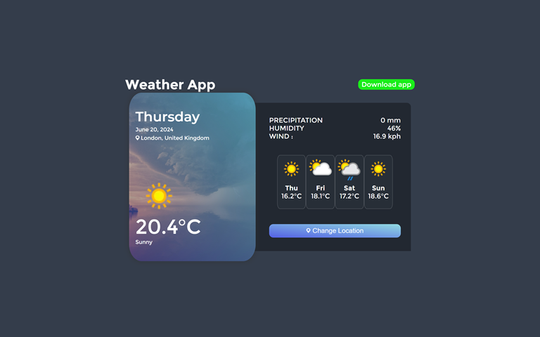
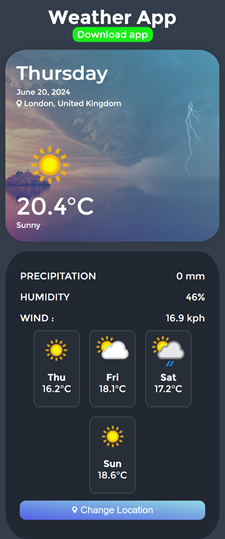
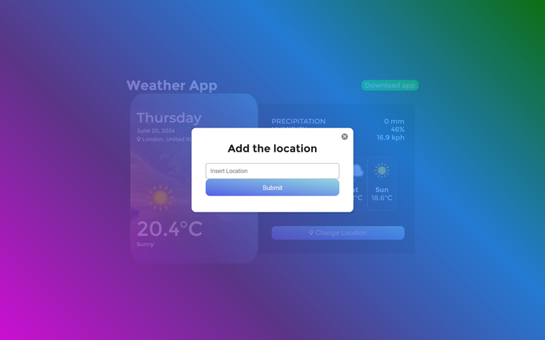

# Weather App

A simple and elegant weather app that provides current weather conditions and a 4-day forecast for any location. Built using HTML, CSS, and JavaScript, and converted to a mobile app using Swing2App.

## Live Preview

You can see a live preview of the app [here](https://ozioma45.github.io/simpleWeatherApp/).

## Features

- **Current Weather Information**: Displays the current weather conditions including temperature, description, precipitation, humidity, and wind speed.
- **4-Day Forecast**: Shows the weather forecast for the next 4 days.
- **Location Search**: Allows users to search for weather information by city name.
- **Responsive Design**: Optimized for both desktop and mobile devices.

## Screenshots





## Technologies Used

- **HTML**: For the structure of the app.
- **CSS**: For styling the app.
- **JavaScript**: For fetching and displaying weather data.
- **Swing2App**: For converting the web app to a mobile app.

## Setup Instructions

To run the app locally:

1. Clone the repository:

   ```bash
   git clone https://github.com/ozioma45/simpleWeatherApp.git
   ```

2. Navigate to the project directory:

   ```bash
   cd simpleWeatherApp
   ```

3. Open `index.html` in your browser to view the app.

## Code Explanation

### HTML

The HTML file structures the app into several sections:

- **Dialog Box**: A popup for searching and adding locations.
- **Header**: Contains the app title and a download button for the mobile app.
- **Current Forecast**: Displays current weather information.
- **4-Day Forecast**: Shows the weather forecast for the next 4 days.

### CSS

The CSS file styles the app with a modern and clean look, ensuring responsiveness for various devices.

### JavaScript

The JavaScript file handles the following:

- **Fetching Weather Data**: Uses the WeatherAPI to fetch current weather and forecast data.
- **Updating UI**: Updates the UI elements with the fetched weather data.
- **Local Storage**: Saves the last searched city to local storage for persistence.
- **Dialog Management**: Manages the open and close actions for the location search dialog.

### Key Functions

- `updateWeatherInfo(localtime, city, country, iconUrl, temp, description, precipitation, humidity, wind)`: Updates the current weather information on the page.
- `displayForecast(forecast, unit)`: Displays the 4-day weather forecast.
- `fetchWeather(location)`: Fetches weather data for the specified location.
- `loadCityFromLocalStorage()`: Loads the city from local storage when the page loads.
- `submitForm()`: Handles the form submission for searching locations.

## How to Use

1. **Open the App**: Open the app in your browser or download the mobile version.
2. **View Current Weather**: The app shows the current weather for the last searched location (default is London).
3. **Change Location**: Click the "Change Location" button, enter a city name, and click "Submit" to view weather for a different location.

## Contributing

Contributions are welcome! Please open an issue or submit a pull request for any improvements or bug fixes.

## License

This project is licensed under the MIT License. See the [LICENSE](LICENSE) file for details.

## Contact

If you have any questions or suggestions, feel free to reach out:

- **Email**: [oziomaegole@gmail.com](mailto:oziomaegole@gmail.com)
- **GitHub**: [ozioma45](https://github.com/ozioma45)
